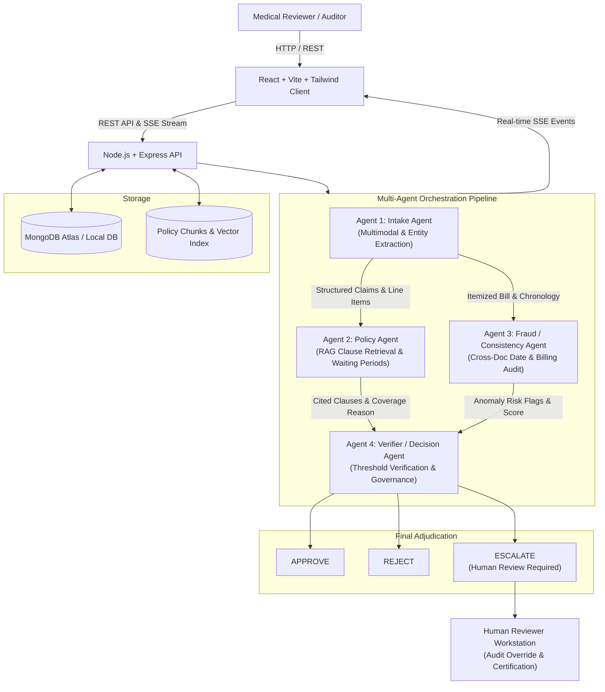

**live demo = https://claimpilot-amber.vercel.app **

# ClaimPilot — AI-Powered Multi-Agent Health Insurance Claim Review

> **Tagline:** "Autonomous Multi-Agent Health Insurance Claim Review & Evidence Adjudication"  
> **Hackathon Theme:** **Agentic AI & Intelligent Systems**

---

## 📌 Executive Summary

Health insurance claims processing is notorious for fragmented workflows, repetitive manual verification, and inconsistent adjudication. Human examiners spend hours manually cross-referencing hospital bills, discharge summaries, prescriptions, diagnostic reports, and dense policy wording to check waiting periods, room-rent sub-limits, and billing arithmetic.

**ClaimPilot** automates this investigation work through a coordinated **deterministic multi-agent orchestration pipeline**. Rather than a generic chatbot or single LLM prompt, ClaimPilot deploys specialized agents that autonomously extract structured entities, retrieve relevant policy clauses using **RAG & Vector Search**, audit cross-document consistency for date mismatches and duplicate charges, and synthesize an evidence-grounded adjudication recommendation:

- **APPROVE** (Full coverage substantiated, zero discrepancies, confidence $\ge 80\%$)
- **REJECT** (Explicit policy exclusion or non-covered procedure cited)
- **ESCALATE** (High-value claims $> ₹500,000$, date contradictions, or low confidence requiring human review)

> [!IMPORTANT]
> **Synthetic Demo Data Notice**: ClaimPilot is an AI-assisted decision support system built strictly using synthetic patient and provider data. It does not replace an authorized medical claims officer.

---

## 🏗️ System Architecture



---

## 🤖 The Multi-Agent System

ClaimPilot employs four specialized agents running in a deterministic sequence:

| Agent | Core Responsibilities | Evidence & Output |
| :--- | :--- | :--- |
| **Agent 1: Intake Agent** | Ingests PDFs, images, and text files. Extracts verified patient demographics, dates, diagnoses, surgical procedures, and itemized billing line items. | Structured JSON with source file citations. Strictly outputs `null` for absent data without fabricating values. |
| **Agent 2: Policy Agent** | Performs semantic RAG vector search across policy documents to check eligibility, permanent exclusions (e.g. cosmetic, experimental), waiting periods, and room rent sub-limits. | Returns `COVERED`, `NOT_COVERED`, or `PARTIALLY_COVERED` with cited policy clause, page number, and quoted clause text. |
| **Agent 3: Fraud / Consistency Agent** | Cross-audits dates (discharge before admission), duplicate charges (same procedure/bed billed twice), diagnosis-treatment compatibility, and arithmetic reconciliation. | Flags anomalies with severity (`LOW`, `MEDIUM`, `HIGH`) and conflicting source documents. Uses neutral phrasing without accusatory bias. |
| **Agent 4: Verifier Agent** | Synthesizes all prior outputs, checks corporate threshold governance (`HIGH_VALUE_CLAIM_THRESHOLD = ₹500,000`, `AI_CONFIDENCE_THRESHOLD = 0.80`), and determines final recommendation. | Produces authoritative `APPROVE`, `REJECT`, or `ESCALATE` with confidence score, executive rationale, and human escalation trigger. |

---

## 💻 Tech Stack

- **Frontend**: React 19, Vite, TypeScript, Tailwind CSS, Lucide React, Axios, React Router v7.
- **Backend**: Node.js 24, Express, TypeScript, Multer, Zod, JWT, bcryptjs, pdf-parse.
- **Database & Retrieval**: MongoDB + Mongoose, MongoDB Atlas Vector Search / Cosine Similarity vector search.
- **AI & Reasoning**: Google Gemini API (`@google/generative-ai`, models `gemini-1.5-flash` / `gemini-1.5-pro` & `text-embedding-004`).
- **Resilience**: Zero-crash graceful fallback mode for zero-credential hackathon demonstrations.

---

## 📁 Repository Directory Structure

```
claimpilot/
├── client/                           # React + Vite Frontend
│   ├── src/
│   │   ├── components/
│   │   │   ├── common/               # Navbar, Button, Card, Badge, Modal, Spinner
│   │   │   └── claims/               # AgentTimeline, FileUploader, StatusBadge,
│   │   │                             # ExtractedInfoCard, PolicyFindingsCard,
│   │   │                             # FraudFlagsCard, DecisionCard, HumanReviewModal
│   │   ├── context/                  # AuthContext (JWT session management)
│   │   ├── hooks/                    # useAgentStream (SSE real-time trace hook)
│   │   ├── pages/                    # LoginPage, RegisterPage, DashboardPage,
│   │   │                             # ClaimsListPage, CreateClaimPage, ClaimDetailsPage,
│   │   │                             # HumanReviewPage
│   │   ├── services/                 # api.ts (Axios), auth.service.ts, claim.service.ts
│   │   ├── types/                    # TypeScript interfaces
│   │   ├── App.tsx                   # Main router and route guards
│   │   ├── main.tsx
│   │   └── index.css                 # Tailwind CSS styles
│   ├── tailwind.config.js
│   ├── vite.config.ts
│   ├── tsconfig.json
│   └── .env.example
├── server/                           # Express + TypeScript Backend
│   ├── src/
│   │   ├── config/                   # env.config.ts, database.ts
│   │   ├── models/                   # User, Claim, Document, AgentExecution,
│   │   │                             # PolicyChunk, Decision
│   │   ├── middleware/               # auth.middleware, upload.middleware,
│   │   │                             # validation.middleware, error.middleware
│   │   ├── validators/               # Zod schemas (auth, claim, review, agent schemas)
│   │   ├── services/
│   │   │   ├── gemini/               # gemini.service.ts (Structured JSON & embeddings)
│   │   │   ├── documents/            # documentParser.service.ts (PDF & text parser)
│   │   │   ├── embeddings/           # embedding.service.ts (Policy chunking & indexing)
│   │   │   ├── vectorSearch/         # vectorSearch.service.ts (Atlas + Cosine RAG)
│   │   │   └── agents/               # intakeAgent, policyAgent, fraudAgent, verifierAgent
│   │   ├── orchestrator/             # claimOrchestrator.ts, eventStream.ts (SSE)
│   │   ├── controllers/              # auth, claim, document, analysis, policy,
│   │   │                             # decision, review, health, demo controllers
│   │   ├── routes/                   # auth.routes, claim.routes, health.routes
│   │   ├── demo/                     # sampleData.ts (4 rich synthetic claim presets)
│   │   ├── app.ts                    # Express app initialization
│   │   └── server.ts                 # Server entry point & vector seeding
│   ├── test/                         # api.test.ts (Automated integration test suite)
│   ├── tsconfig.json
│   ├── package.json
│   └── .env.example
├── package.json                      # Monorepo scripts
├── .gitignore
├── .env.example                      # Root configuration template
└── README.md
```

---

## ⚡ Quick Start & Local Setup

### 1. Prerequisites
- **Node.js**: v18+ (tested on Node v24)
- **NPM**: v9+ (tested on NPM 11)
- **MongoDB**: Local MongoDB instance or free MongoDB Atlas URI

### 2. Installation
Install dependencies across both client and server:

```bash
# In server directory
cd server
npm install

# In client directory
cd ../client
npm install
```

### 3. Environment Variables
Copy `.env.example` into `server/.env`:

```ini
PORT=5000
NODE_ENV=development
CLIENT_URL=http://localhost:5173
MONGODB_URI=mongodb://localhost:27017/claimpilot
JWT_SECRET=claimpilot_super_secret_jwt_key_987654321
JWT_EXPIRES_IN=7d

# Google Gemini API Key (Get free key at https://aistudio.google.com/)
GEMINI_API_KEY=your_gemini_api_key_here
GEMINI_MODEL=gemini-1.5-flash

# Multi-Agent Governance Thresholds
AI_CONFIDENCE_THRESHOLD=0.80
HIGH_VALUE_CLAIM_THRESHOLD=500000
```

Copy `.env.example` into `client/.env`:

```ini
VITE_API_URL=http://localhost:5000/api
```

*(Note: ClaimPilot features a resilient fallback mode. If `GEMINI_API_KEY` is not provided, the multi-agent pipeline and rules engine remain fully operational using deterministic heuristics so judges can evaluate all 4 demo scenarios immediately!)*

---

## 🏃 Running the Application

### Start Backend (Terminal 1)
```bash
cd server
npm run dev
```
The server will boot on `http://localhost:5000`.  
Health check: `http://localhost:5000/api/health`

### Start Frontend (Terminal 2)
```bash
cd client
npm run dev
```
The client will open on `http://localhost:5173`.

### Run Automated Tests
```bash
cd server
npm test
```
Runs the automated test suite testing auth validation, Intake Agent entity extraction, Fraud Agent date mismatch detection, and Verifier Agent governance rules.

---

## 🎯 4 Hackathon Demo Presets (1-Click Test)

ClaimPilot includes 4 pre-packaged synthetic claim scenarios ready for instant evaluation from the dashboard:

| Preset | Scenario Description | Expected Decision |
| :--- | :--- | :--- |
| **Demo 1: Valid Claim** | Acute Meniscus Tear with arthroscopic knee repair. All invoice sums match, dates reconcile, room rent is within limits, and waiting period is completed. | **APPROVE** (Confidence 92%) |
| **Demo 2: Policy Exclusion** | Cosmetic Rhinoplasty (aesthetic nose reshaping). Explicitly excluded under Clause 5.1 (Permanent Exclusions: Aesthetic Surgeries). | **REJECT** (Confidence 96%) |
| **Demo 3: Document Inconsistency** | Discharge summary records discharge 5 days *before* admission, and line items don't sum to billed total. | **ESCALATE** (High-severity date & billing anomaly) |
| **Demo 4: High Value & Duplicate Billing** | Claim amount (₹640,000) exceeds high-value threshold (₹500,000) with duplicate ICU charges on the same date. | **ESCALATE** (High-Value mandatory audit) |

### Demo Credentials
- **Email:** `reviewer@claimpilot.ai`
- **Password:** `reviewer123`  
*(Or click the "Auto-fill Credentials" button on the sign-in page)*

---

## 🌐 API Endpoint Reference

### Authentication
- `POST /api/auth/register` — Register a new reviewer
- `POST /api/auth/login` — Sign in and obtain JWT
- `GET /api/auth/me` — Get active reviewer profile

### Claims Portfolio
- `POST /api/claims` — Create a new claim
- `GET /api/claims` — List claims (with search, status filter, and pagination)
- `GET /api/claims/:id` — Get claim dossier, documents, executions, and decision
- `DELETE /api/claims/:id` — Delete claim and its associated artifacts
- `GET /api/claims/analytics/stats` — Get real-time portfolio statistics

### Documents & Artifacts
- `POST /api/claims/:id/documents` — Multi-file upload via Multer (PDF, PNG, JPG, TXT)
- `GET /api/claims/:id/documents` — List attached documents

### Agent Orchestration & Real-Time Trace
- `POST /api/claims/:id/analyze` — Trigger the 4-agent orchestration workflow
- `GET /api/claims/:id/analysis` — Get latest analysis and decision
- `GET /api/claims/:id/agent-executions` — Get step-by-step agent logs
- `GET /api/claims/:id/trace/stream` — **Server-Sent Events (SSE)** live agent execution trace

### Policy RAG & Decision
- `GET /api/claims/:id/policy-evidence` — Get retrieved policy clauses and quotes
- `GET /api/claims/:id/decision` — Get final adjudication decision

### Human Adjudication Workstation
- `POST /api/claims/:id/review` — Reviewer certifies or overrides claim (`APPROVE` / `REJECT` with audit comments)

### Demo & Diagnostics
- `GET /api/claims/demo/presets` — List available synthetic presets
- `POST /api/claims/demo/seed` — 1-click synthetic claim creation
- `GET /api/health` — System health check and diagnostics

---

## 🚀 Deployment Guide

### Deploy Backend (Render / Railway)
1. Push repository to GitHub.
2. In Render/Railway, create a new Web Service pointing to the root directory with Root Directory set to `server`.
3. Build Command: `npm install && npm run build`
4. Start Command: `node dist/server.js`
5. Set environment variables: `PORT`, `MONGODB_URI`, `JWT_SECRET`, `CLIENT_URL`, `GEMINI_API_KEY`.

### Deploy Frontend (Vercel)
1. Import repository into Vercel with Root Directory set to `client`.
2. Framework Preset: `Vite`.
3. Build Command: `npm run build`
4. Output Directory: `dist`
5. Environment Variable: `VITE_API_URL` pointing to deployed backend API URL (e.g. `https://claimpilot-api.onrender.com/api`).

---

## 🔒 Security & Data Privacy
- **Stateless Authentication**: Cryptographically signed JSON Web Tokens (JWT) with bcrypt salt rounds.
- **Strict Data Sanitization**: Zod request schema validation on all inputs and AI outputs.
- **Zero API Key Leakage**: `GEMINI_API_KEY` exists exclusively on the backend server.
- **File Validation**: Strict MIME-type checking and 15MB file-size limits.
- **Synthetic Data Compliance**: Tested only against synthetic, de-identified clinical records.

---

## 🏆 Hackathon Alignment Checklist

- [x] **Autonomous AI agents**: 4 dedicated agents with defined responsibilities.
- [x] **Planning**: Deterministic multistep pipeline passing verified context forward.
- [x] **Reasoning**: Gemini structured reasoning grounded in extracted facts.
- [x] **Multi-agent collaboration**: Verifier synthesizes outputs from Intake, Policy, and Fraud agents.
- [x] **Tool usage & RAG**: Policy vector retrieval with cited clause numbers and page references.
- [x] **Evidence-based decisions**: Every policy and fraud conclusion cites specific source documents.
- [x] **Human escalation**: Automatic escalation for high-value claims ($> ₹500,000$) or low confidence.
- [x] **Real-world business value**: Cuts health insurance claim adjudication times from hours to seconds.
